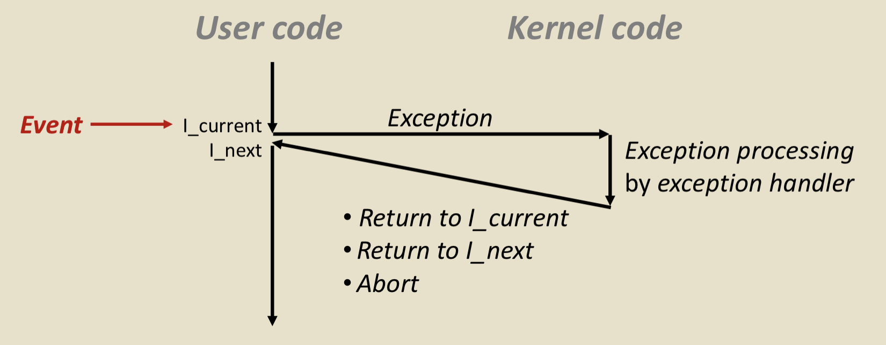

# Exceptional Control Flow

机器的一系列指令执行称作control flow,在汇编一章中，我们已经了解了**程序级别**的控制流变化,例如用Jumps and branches, call and return来改变指令操作的顺序。接下来我们要学习的是**系统级别**的改变,例如数据在磁盘和内存的运输，键盘上的Ctrl-C停止的作用等，也就是**exceptional control flow**（异常控制流）的机制。


# Exceptions
An exception is a transfer of control to the OS kernel in response to some event (i.e., change in processor state)。也即异常是内核对事件的响应，是一种低级别的机制。




> Exception Tables
> Events组成一个表，当Event k发生时，系统查询索引为k的地址，得到处理异常的程序。

## 同步与异步

### 异步异常(Asynchronous Exceptions)
异步异常是由外部时间触发的对处理器的操作，也被称为Interrupts。例如每隔几毫秒，外部的timer chip触发一次异常来从用户程序中拿回控制权，在终端输入Ctrl-C等。

### 同步异常(Synchronous Exceptions)
在执行指令中遇到了相应的Events。

- Traps 人为地设置，如断点调试，系统调用等，结果是返回控制权给下一条指令。
- Faults 非故意但可恢复或者不可恢复的，如浮点数的异常等，结果是重新执行此条指令或者终止
- Aborts 非故意且不可恢复的，结果是停止此程序。

## Processes
**A process is an instatnce of a running program**


一个进程的假象：
- logical control flow 每个进程似乎独占CPU，由上下文切换实现
- private address space 似乎都有自己的一块内存空间，由虚拟内存实现

### Concurrent Processes
并发进程几乎无时无刻不在发生，接下来我们将从上下文切换的角度理解。

我们将process视为一个逻辑控制流，当两个逻辑控制流在时间上重叠时，它们是**并发**的。

当处理器是单核时，CPU每次执行一个process，为了实现并发，它在两个process间切换执行。当处理器是多核时，每一个cpu都可以单独执行一个process，同样的此时每一个核又可以并发。


> 上下文切换的细节：将上一个进程的寄存器的值保存在内存中（相当于caller saved?）。上下文切换从代码角度，是一个user code到另一个user code的过渡，而这个过渡由kernel code实现。


## Process Control(API)
从程序员的角度考虑，进程有三种状态，Running, Stopped, Terminated。以下的函数是系统调用，可以改变进程的状态。

### exit 
Terminate the program with status, 正常退出为0，非正常退出返回非0值，exit只会被执行一次，不会return


### Fork
fork函数构建一个子进程。

fork被调用一次，但是会有两个返回值，在父进程中返回子进程号，在子进程中返回0，可以通过返回值来分辨此时在哪个进程中。可以把返回值以链表的形式理解，父进程指向下一个子进程，而子进程如果在链表末端时，则指向NULL也即是0。

fork的返回值很重要，每次必须判断是否成功创建子进程，为了使判断的代码更加compact，所以用Fork重写代码。
```C

void unix_error(char* msg)
{
	fprintf(stderr, "%s: %s\n", msg, strerror(errno));
	exit(-1);
}

pid_t Fork(void)
{
	pid_t pid;

	if((pid = fork())<0)
		unix_error("Fork error");
	return pid;
}
```

下面来看一个例子：
```C
#include "csapp.h"

int main()
{
    int x = 1;

    if(Fork() == 0)
        printf("p1: %d\n", ++x);
    printf("p2: %d\n", --x);

    return 0;
}
```
```bash
//输出
p2: 0 //父进程
p1: 2 //子进程
p2: 1 //子进程
```
首先执行到Fork时，就像薛定谔的猫，进程处于量子叠加态，既是父进程也是子进程。接下来用一个if判断将两者分离。在这个例子中，我们很容易发现，每个进程都有自己变量的拷贝，x互不影响，那么它们的虚拟地址如何呢？

更改代码为输出地址，结果如下。

```bash
p2: 0x7fffd2bc7fe4
p1: 0x7fffd2bc7fe4
p2: 0x7fffd2bc7fe4
```

可以看到变量的虚拟地址都是相同的，但它们的实际地址不同。


### 僵尸进程与wait回收

当子进程结束运行，而父进程没有对其回收的话，子进程沦为僵尸进程，还占用资源。
如果父进程被kill，子进程结束运行，子进程会由**init**回收。
如果父进程结束运行，子进程不终止，那么子进程无法结束、回收。
使用wait可以使父进程显示地对子进程回收，父进程会一直suspend直到子进程终止。


### execve
```C
#include <unistd.h>

int execve(const char *filenaem, const char *argv[],
		   const char *envp[]);
		   //Does not return if OK;returns -1 on error
```
执行程序(第三个参数直接写入全局变量 environ，由libc决定)


## Signals
信号是传送给process的一种信息，可以用于进程间的通信。例如当键盘键入Ctrl+C时，kenerl终止所有foreground的process通过信号SIGINT。总的来说，信号的起作用可以分为两步：sending/delivering　&　receiving

### sending 

信号总是由kernel发送的。kernel可以通过某些event的触发自主发送signal，process也可以通过kill函数的调用请求kernel发送signal。

### kill
```C
#include <sys/types.h>
#include <signal.h>

int kill(pid_t pid, int sig);
```

- pid>0: 发送信号给pid的process
- pid=0: 发送信号给调用process所在process gruop的所有processes
- pid<0: 发送信号给pid group为-pid的所有processes

### receiving
信号的receive是在上下文切换中完成的，也就是从kenel code切换回user code后起作用。

信号发送但是未被received（未被处理时）称为pending。信号在这个阶段起作用靠pending bit vector & blocked bit vector，不同信号的信号发送会储存在pending bit vector中，相同类型的会被抛弃（该bit已经被置1了）。bloked bit vector则是掩码，设置为1的位置对应信号不会起作用，因为最后信号的处理是由**pending & ~blocked**(unblocked pending signals)决定。当掩码起作用时，该信号被**忽略**。

Signal接收的时机是在进入进程前，kernal会检查是否有待处理的信号


### Catch

每个Signal有默认的执行结果，用户可以通过修改__singal_handler__函数以自定义Signal的作用。Kernel执行signal_hander称为信号的**捕获（catch）**。


> signal_handelr也属于进程调用的一部分，可以被其他信号处理函数打断

但是信号9 SIGKILL和信号19 SIGSTOP不可被忽略或重写。

**SIGCHLD**: 当子进程的**状态改变**时，如终止，暂停等，都会发送给父进程，所以可以重设signal_chld_handler,先判断进程的情况再操作。

### Handlers的处理守则


## 竞争
由于不知道子进程和父进程的执行先后顺序，当它们都会对某一对象操作时，其实际先后顺序可能并不是我们想要的，这称之为**竞争（Race）**。避免竞争一种的办法是显示的阻塞信号，这样可以避免进程和handler之间的竞争。


